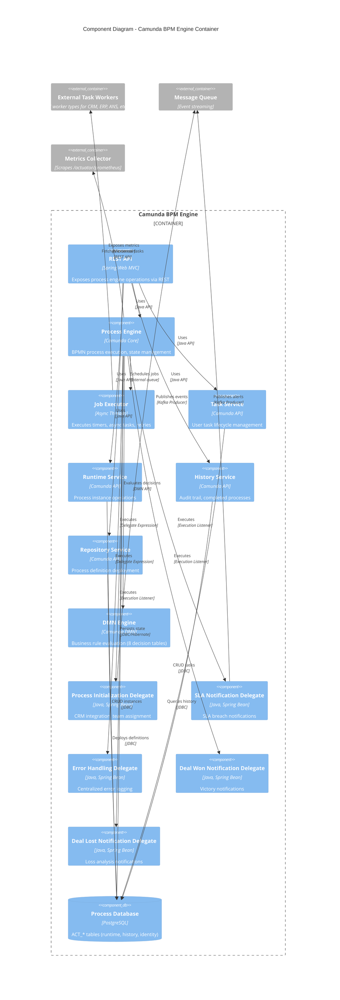
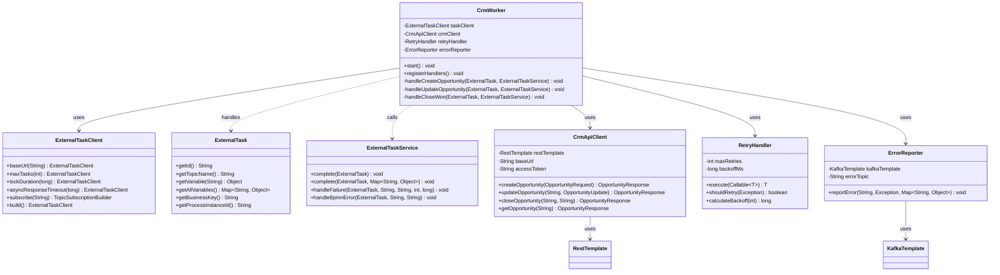
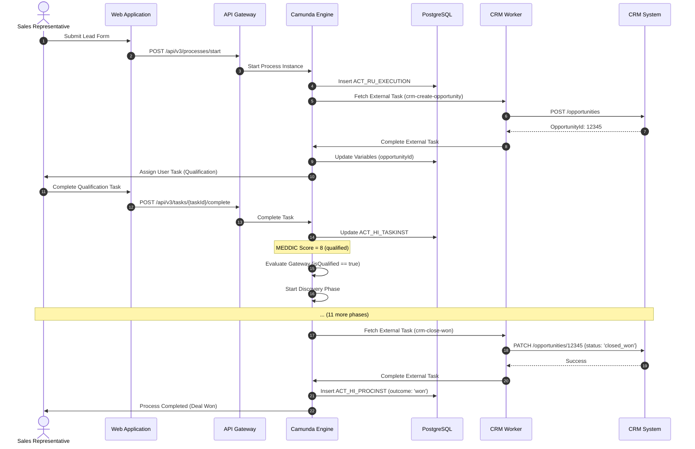
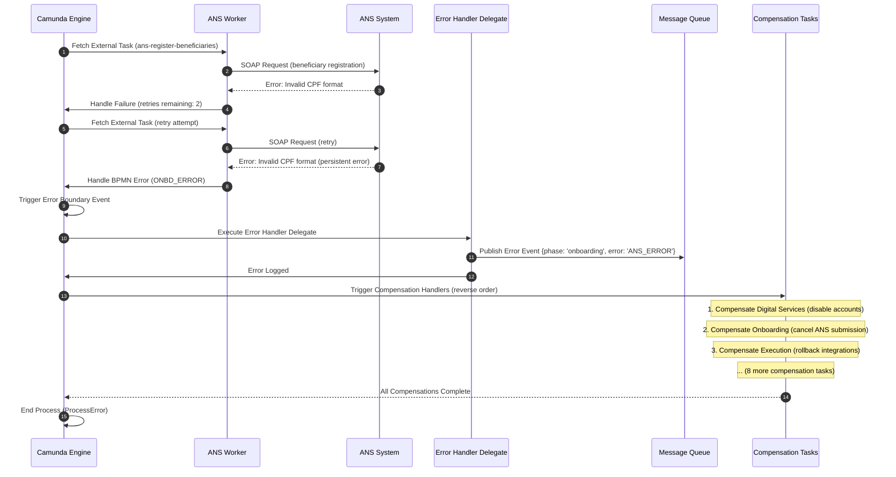
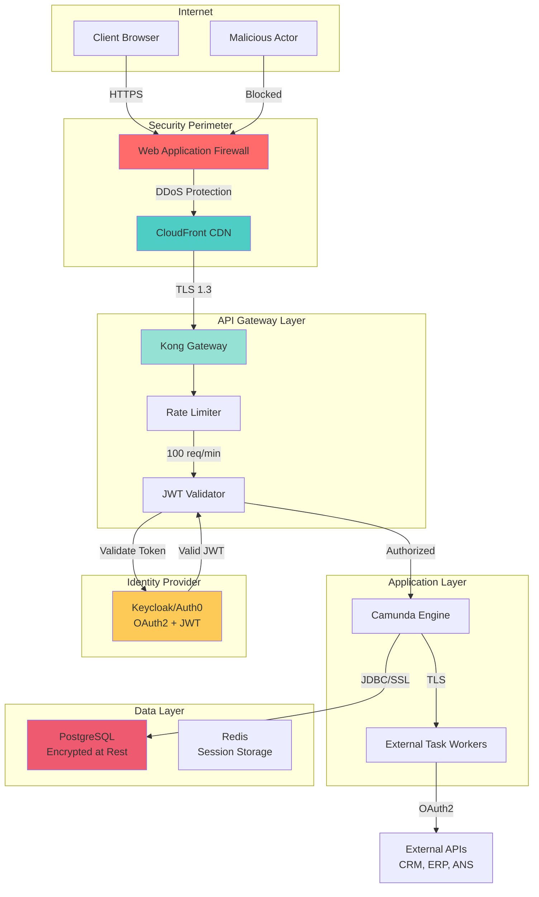

# V3 C4 Architecture Diagrams
**AUSTA B2B Sales Automation Platform - Version 3**

**Document Purpose**: Visualize system architecture using C4 model (Context, Container, Component, Code)

**Date**: 2025-12-08
**Status**: APPROVED - Implementation Ready
**Version**: 1.0.0

---

## ABOUT C4 MODEL

The C4 model provides a hierarchical set of architectural diagrams:
- **Level 1 - Context**: System in its environment (users, external systems)
- **Level 2 - Container**: High-level technology choices (applications, databases)
- **Level 3 - Component**: Internal structure of containers (modules, classes)
- **Level 4 - Code**: Class diagrams (optional, usually UML)

---

## LEVEL 1: SYSTEM CONTEXT DIAGRAM

**Purpose**: Show how the AUSTA B2B Sales Automation System fits into its environment

```mermaid
C4Context
    title System Context - AUSTA B2B Sales Automation Platform V3

    Person(salesRep, "Sales Representative", "Executes qualification, discovery, proposal tasks")
    Person(salesManager, "Sales Manager", "Approves proposals, reviews progress")
    Person(director, "Commercial Director", "Approves high-value deals, strategic decisions")
    Person(executive, "C-Level Executive", "Approves mega deals, oversees performance")
    Person(customerSuccess, "Customer Success Manager", "Monitors accounts, identifies expansion")
    Person(operations, "Operations Team", "Implements solutions, onboards beneficiaries")
    Person(legal, "Legal Counsel", "Reviews contracts, ensures compliance")

    System(austaSystem, "AUSTA B2B Sales Automation System", "Automates end-to-end B2B sales lifecycle: lead → expansion")

    Person_Ext(client, "Client (B2B Company)", "Receives proposals, signs contracts, uses health insurance")

    System_Ext(crmSystem, "CRM System", "Salesforce/HubSpot - Opportunity management")
    System_Ext(erpSystem, "ERP System", "TOTVS/SAP - Financial integration, billing")
    System_Ext(ansSystem, "ANS System", "Brazilian health insurance regulator - Beneficiary registration")
    System_Ext(digitalServices, "Digital Services Platform", "User provisioning, mobile app, telemedicine")
    System_Ext(documentMgmt, "Document Management", "Alfresco/SharePoint - Proposal/contract storage")
    System_Ext(eSignature, "E-Signature Platform", "DocuSign/Clicksign - Contract signing")
    System_Ext(communications, "Communications Platform", "Email (SendGrid), SMS (Twilio), WhatsApp")

    Rel(salesRep, austaSystem, "Executes tasks, enters data", "HTTPS/Web UI")
    Rel(salesManager, austaSystem, "Reviews, approves", "HTTPS/Web UI")
    Rel(director, austaSystem, "Approves", "HTTPS/Web UI")
    Rel(executive, austaSystem, "Approves, monitors", "HTTPS/Web UI")
    Rel(customerSuccess, austaSystem, "Monitors, expands", "HTTPS/Web UI")
    Rel(operations, austaSystem, "Implements, onboards", "HTTPS/Web UI")
    Rel(legal, austaSystem, "Reviews contracts", "HTTPS/Web UI")

    Rel(austaSystem, client, "Sends proposals, requests signatures", "Email, SMS, WhatsApp")
    Rel(client, austaSystem, "Responds to proposals", "Email")

    Rel(austaSystem, crmSystem, "Creates/updates opportunities", "REST API, OAuth2")
    Rel(austaSystem, erpSystem, "Creates customers, posts revenue", "SOAP/REST, API Key")
    Rel(austaSystem, ansSystem, "Registers beneficiaries", "SOAP, ICP-Brasil Certificate")
    Rel(austaSystem, digitalServices, "Provisions accounts, activates services", "REST API, OAuth2")
    Rel(austaSystem, documentMgmt, "Stores proposals/contracts", "REST API, API Key")
    Rel(austaSystem, eSignature, "Requests signatures", "REST API + Webhooks")
    Rel(austaSystem, communications, "Sends notifications", "SMTP, REST API")

    UpdateLayoutConfig($c4ShapeInRow="3", $c4BoundaryInRow="2")
```



**Key Insights**:
- **7 user personas** (internal stakeholders with different roles)
- **1 external persona** (client companies)
- **7 external systems** (integrations critical for process execution)
- **Authentication**: HTTPS + OAuth2 for all external APIs
- **Compliance**: ANS integration is regulatory requirement (ICP-Brasil certificate)

---

## LEVEL 2: CONTAINER DIAGRAM

**Purpose**: Show high-level technology choices and how containers communicate

```mermaid
C4Container
    title Container Diagram - AUSTA B2B Sales Automation Platform V3

    Person(user, "System User", "Sales team, managers, operations")
    Person_Ext(client, "Client", "B2B company decision maker")

    System_Boundary(c1, "AUSTA B2B Sales Automation System") {
        Container(webUI, "Web Application", "React.js, Nginx", "User interface for task execution, form submission")
        Container(apiGateway, "API Gateway", "Kong Gateway", "API routing, rate limiting, JWT validation")

        Container(camundaEngine, "Camunda BPM Engine", "Java 21, Spring Boot 3", "Process orchestration (13 subprocesses), user task management")

        ContainerDb(postgres, "Process Database", "PostgreSQL 14", "Stores process instances, tasks, variables, audit trail")

        Container(externalWorkers, "External Task Workers", "Java 21, Spring Boot 3", "Service task execution (CRM, ERP, ANS, etc.)")

        Container(kafka, "Message Queue", "Apache Kafka", "Event streaming, async communication, notifications")

        ContainerDb(redis, "Cache", "Redis", "Session storage, API response caching")

        Container(prometheus, "Metrics Collector", "Prometheus", "Scrapes metrics from all services")
        Container(grafana, "Dashboards", "Grafana", "Visualizes metrics, process KPIs")
        Container(elk, "Log Aggregator", "Elasticsearch + Logstash + Kibana", "Centralized logging, log search")
        Container(jaeger, "Distributed Tracing", "Jaeger", "Request tracing across services")
    }

    System_Ext(crmSystem, "CRM System", "Salesforce/HubSpot")
    System_Ext(erpSystem, "ERP System", "TOTVS/SAP")
    System_Ext(ansSystem, "ANS System", "Brazilian regulator")
    System_Ext(digitalServices, "Digital Services", "User provisioning platform")
    System_Ext(documentMgmt, "Document Management", "Alfresco/SharePoint")
    System_Ext(eSignature, "E-Signature", "DocuSign/Clicksign")
    System_Ext(communications, "Communications", "SendGrid, Twilio")

    Rel(user, webUI, "Uses", "HTTPS")
    Rel(webUI, apiGateway, "API calls", "HTTPS/JSON")
    Rel(apiGateway, camundaEngine, "Routes to", "HTTP/REST")

    Rel(camundaEngine, postgres, "Reads/writes", "JDBC, SQL")
    Rel(camundaEngine, externalWorkers, "Fetches external tasks", "REST API")
    Rel(camundaEngine, kafka, "Publishes events", "Kafka Protocol")

    Rel(externalWorkers, crmSystem, "Integrates", "REST, OAuth2")
    Rel(externalWorkers, erpSystem, "Integrates", "SOAP/REST")
    Rel(externalWorkers, ansSystem, "Integrates", "SOAP, Certificate")
    Rel(externalWorkers, digitalServices, "Integrates", "REST, OAuth2")
    Rel(externalWorkers, documentMgmt, "Integrates", "REST, API Key")
    Rel(externalWorkers, eSignature, "Integrates", "REST, Webhooks")
    Rel(externalWorkers, communications, "Integrates", "SMTP, REST")

    Rel(kafka, communications, "Triggers notifications", "Consumer")

    Rel(camundaEngine, prometheus, "Exposes metrics", "/actuator/prometheus")
    Rel(externalWorkers, prometheus, "Exposes metrics", "/actuator/prometheus")
    Rel(prometheus, grafana, "Feeds data", "PromQL")

    Rel(camundaEngine, elk, "Ships logs", "Logstash")
    Rel(externalWorkers, elk, "Ships logs", "Logstash")

    Rel(camundaEngine, jaeger, "Sends traces", "OpenTelemetry")
    Rel(externalWorkers, jaeger, "Sends traces", "OpenTelemetry")

    Rel(apiGateway, redis, "Caches responses", "Redis Protocol")

    UpdateLayoutConfig($c4ShapeInRow="4", $c4BoundaryInRow="3")
```



**Key Insights**:
- **Separation of Concerns**: Camunda Engine focuses on orchestration, External Workers handle integrations
- **Async Communication**: Kafka decouples notification delivery from process execution
- **Caching Layer**: Redis reduces load on Camunda Engine and external APIs
- **Observability Stack**: Prometheus + Grafana + ELK + Jaeger provide full visibility
- **API Gateway**: Centralized entry point for authentication, rate limiting, routing

---

## LEVEL 3: COMPONENT DIAGRAM (Camunda Engine Container)

**Purpose**: Show internal components of the Camunda BPM Engine container



**Key Insights**:
- **Core Services**: 6 Camunda services (Process, Task, Runtime, History, Repository, DMN)
- **Delegates**: 5 custom Java delegates for critical integration points
- **Async Execution**: Job Executor handles timers, retries, and external task polling
- **DMN Integration**: Business rules externalized to 8 DMN decision tables
- **Event Publishing**: Delegates publish events to Kafka for notification delivery

---

## LEVEL 3: COMPONENT DIAGRAM (External Task Workers Container)

**Purpose**: Show internal components of the External Task Workers container

```mermaid
C4Component
    title Component Diagram - External Task Workers Container

    Container_Boundary(c1, "External Task Workers") {
        Component(crmWorker, "CRM Worker", "Java, Camunda External Task Client", "15 topics: create-opportunity, update-opportunity, close-won, etc.")
        Component(erpWorker, "ERP Worker", "Java, Camunda External Task Client", "8 topics: create-customer, post-revenue, generate-invoice, etc.")
        Component(ansWorker, "ANS Worker", "Java, Camunda External Task Client", "2 topics: register-beneficiaries, report-plan-changes")
        Component(digitalWorker, "Digital Services Worker", "Java, Camunda External Task Client", "7 topics: create-accounts, configure-app, activate-portal, etc.")
        Component(documentWorker, "Document Worker", "Java, Camunda External Task Client", "4 topics: generate-proposal, generate-contract, store-document, etc.")
        Component(signatureWorker, "E-Signature Worker", "Java, Camunda External Task Client", "3 topics: request-signature, validate-signature, retrieve-signed, etc.")
        Component(commWorker, "Communications Worker", "Java, Camunda External Task Client", "10+ topics: send-email, send-sms, send-whatsapp, etc.")

        Component(crmClient, "CRM Client", "REST Client, Feign", "Salesforce/HubSpot API client")
        Component(erpClient, "ERP Client", "SOAP/REST Client", "TOTVS/SAP API client")
        Component(ansClient, "ANS Client", "SOAP Client", "ANS XML submission client with ICP-Brasil certificate")
        Component(digitalClient, "Digital Services Client", "REST Client", "Digital platform API client")
        Component(documentClient, "Document Management Client", "REST Client", "Alfresco/SharePoint API client")
        Component(signatureClient, "E-Signature Client", "REST Client + Webhook Receiver", "DocuSign/Clicksign API client")
        Component(emailClient, "Email Client", "SMTP Client", "SendGrid SMTP client")
        Component(smsClient, "SMS Client", "REST Client", "Twilio API client")
        Component(whatsappClient, "WhatsApp Client", "REST Client", "WhatsApp Business API client")

        Component(retryHandler, "Retry Handler", "Java, Custom Logic", "Exponential backoff, circuit breaker")
        Component(errorReporter, "Error Reporter", "Java, Kafka Producer", "Publishes errors to Kafka")
    }

    System_Ext(crmSystem, "CRM System", "Salesforce/HubSpot")
    System_Ext(erpSystem, "ERP System", "TOTVS/SAP")
    System_Ext(ansSystem, "ANS System", "Brazilian regulator")
    System_Ext(digitalServices, "Digital Services", "User provisioning")
    System_Ext(documentMgmt, "Document Management", "Alfresco/SharePoint")
    System_Ext(eSignature, "E-Signature", "DocuSign/Clicksign")
    Container_Ext(kafka, "Message Queue", "Error events, notifications")
    Container_Ext(camundaEngine, "Camunda Engine", "Fetches external tasks")

    Rel(crmWorker, camundaEngine, "Polls for tasks", "REST API")
    Rel(erpWorker, camundaEngine, "Polls for tasks", "REST API")
    Rel(ansWorker, camundaEngine, "Polls for tasks", "REST API")
    Rel(digitalWorker, camundaEngine, "Polls for tasks", "REST API")
    Rel(documentWorker, camundaEngine, "Polls for tasks", "REST API")
    Rel(signatureWorker, camundaEngine, "Polls for tasks", "REST API")
    Rel(commWorker, camundaEngine, "Polls for tasks", "REST API")

    Rel(crmWorker, crmClient, "Uses", "Method calls")
    Rel(erpWorker, erpClient, "Uses", "Method calls")
    Rel(ansWorker, ansClient, "Uses", "Method calls")
    Rel(digitalWorker, digitalClient, "Uses", "Method calls")
    Rel(documentWorker, documentClient, "Uses", "Method calls")
    Rel(signatureWorker, signatureClient, "Uses", "Method calls")
    Rel(commWorker, emailClient, "Uses", "Method calls")
    Rel(commWorker, smsClient, "Uses", "Method calls")
    Rel(commWorker, whatsappClient, "Uses", "Method calls")

    Rel(crmClient, crmSystem, "Calls API", "HTTPS, OAuth2")
    Rel(erpClient, erpSystem, "Calls API", "SOAP/REST")
    Rel(ansClient, ansSystem, "Submits XML", "SOAP, Certificate")
    Rel(digitalClient, digitalServices, "Calls API", "HTTPS, OAuth2")
    Rel(documentClient, documentMgmt, "Calls API", "HTTPS, API Key")
    Rel(signatureClient, eSignature, "Calls API + Receives webhooks", "HTTPS")
    Rel(emailClient, communications, "Sends email", "SMTP")
    Rel(smsClient, communications, "Sends SMS", "REST API")
    Rel(whatsappClient, communications, "Sends WhatsApp", "REST API")

    Rel(crmWorker, retryHandler, "Uses", "Method calls")
    Rel(erpWorker, retryHandler, "Uses", "Method calls")
    Rel(ansWorker, retryHandler, "Uses", "Method calls")

    Rel(crmWorker, errorReporter, "Reports failures", "Method calls")
    Rel(erpWorker, errorReporter, "Reports failures", "Method calls")
    Rel(ansWorker, errorReporter, "Reports failures", "Method calls")

    Rel(errorReporter, kafka, "Publishes errors", "Kafka Producer")

    UpdateLayoutConfig($c4ShapeInRow="4", $c4BoundaryInRow="2")
```

**Key Insights**:
- **7 Worker Types**: One per external system category
- **60+ External Task Topics**: Granular topic design for specific operations
- **API Clients**: Abstraction layer for external system APIs
- **Retry Logic**: Exponential backoff, circuit breaker pattern
- **Error Reporting**: Failures published to Kafka for alerting

---

## LEVEL 4: CODE DIAGRAM (Example: CRM Worker Class Structure)

**Purpose**: Show detailed class structure for one worker (optional, usually UML)



**Key Insights**:
- **Worker Pattern**: Poll-based external task execution
- **API Abstraction**: CrmApiClient encapsulates REST calls
- **Error Handling**: RetryHandler + ErrorReporter for resilience
- **Camunda Integration**: ExternalTaskClient + ExternalTaskService

---

## DEPLOYMENT DIAGRAM (Kubernetes)

**Purpose**: Show how containers are deployed in production environment

```mermaid
C4Deployment
    title Deployment Diagram - AUSTA B2B Sales Automation Platform V3 (Production)

    Deployment_Node(aws, "AWS Cloud", "Amazon Web Services") {
        Deployment_Node(eks, "EKS Cluster", "Kubernetes 1.28+") {
            Deployment_Node(webPod, "Web Application Pods", "2-5 replicas") {
                Container(webUI, "Web Application", "React.js + Nginx", "Static assets, SPA")
            }

            Deployment_Node(apiPod, "API Gateway Pods", "2-5 replicas") {
                Container(apiGateway, "API Gateway", "Kong Gateway", "Rate limiting, JWT validation")
            }

            Deployment_Node(enginePod, "Camunda Engine Pods", "3-10 replicas, HPA-enabled") {
                Container(camundaEngine, "Camunda BPM Engine", "Java 21, Spring Boot 3", "Process orchestration")
            }

            Deployment_Node(workerPod1, "CRM Worker Pods", "5-20 replicas, HPA-enabled") {
                Container(crmWorker, "CRM Worker", "Java 21, Spring Boot 3", "CRM integrations")
            }

            Deployment_Node(workerPod2, "ERP Worker Pods", "3-10 replicas, HPA-enabled") {
                Container(erpWorker, "ERP Worker", "Java 21, Spring Boot 3", "ERP integrations")
            }

            Deployment_Node(workerPod3, "ANS Worker Pods", "2-5 replicas, HPA-enabled") {
                Container(ansWorker, "ANS Worker", "Java 21, Spring Boot 3", "ANS compliance")
            }

            Deployment_Node(monitoringPod, "Monitoring Pods", "1-2 replicas") {
                Container(prometheus, "Prometheus", "Prometheus 2.45+", "Metrics collection")
                Container(grafana, "Grafana", "Grafana 10.0+", "Dashboards")
            }

            Deployment_Node(kafkaPod, "Kafka Pods", "5 brokers, StatefulSet, multi-AZ") {
                Container(kafka, "Apache Kafka", "Kafka 3.5+", "Event streaming")
            }
        }

        Deployment_Node(rds, "RDS", "Managed PostgreSQL") {
            ContainerDb(postgres, "PostgreSQL", "PostgreSQL 14, db.r5.xlarge, Multi-AZ", "Process database")
        }

        Deployment_Node(elasticache, "ElastiCache", "Managed Redis") {
            ContainerDb(redis, "Redis", "Redis 7, cache.m5.large", "Session cache, API cache")
        }

        Deployment_Node(s3, "S3", "Object Storage") {
            ContainerDb(s3Bucket, "Document Storage", "S3 Bucket, 2 TB", "Proposals, contracts, backups")
        }

        Deployment_Node(cloudfront, "CloudFront", "CDN") {
            Container(cdn, "CDN", "CloudFront distribution", "Static asset delivery")
        }
    }

    Rel(cloudfront, webPod, "Forwards requests", "HTTPS")
    Rel(webPod, apiPod, "API calls", "HTTPS")
    Rel(apiPod, enginePod, "Routes requests", "HTTP")
    Rel(enginePod, postgres, "Persists state", "JDBC/SSL")
    Rel(enginePod, redis, "Caches data", "Redis Protocol")
    Rel(enginePod, workerPod1, "Fetches tasks", "REST API")
    Rel(enginePod, workerPod2, "Fetches tasks", "REST API")
    Rel(enginePod, workerPod3, "Fetches tasks", "REST API")
    Rel(enginePod, kafkaPod, "Publishes events", "Kafka Protocol")
    Rel(workerPod1, s3Bucket, "Stores documents", "AWS SDK")
    Rel(prometheus, enginePod, "Scrapes metrics", "/actuator/prometheus")
    Rel(prometheus, workerPod1, "Scrapes metrics", "/actuator/prometheus")
    Rel(grafana, prometheus, "Queries metrics", "PromQL")

    UpdateLayoutConfig($c4ShapeInRow="3", $c4BoundaryInRow="2")
```

**Key Insights**:
- **Kubernetes Orchestration**: Auto-scaling, self-healing, service discovery
- **Horizontal Scaling**: 3-10 engine pods, 5-20 worker pods (HPA-enabled)
- **Managed Services**: RDS PostgreSQL (Multi-AZ), ElastiCache Redis, S3
- **CDN**: CloudFront for static asset delivery (reduced latency)
- **Multi-AZ Deployment**: High availability across availability zones

---

## DATA FLOW DIAGRAMS

### Data Flow 1: Happy Path (Lead to Closed Won)



### Data Flow 2: Error Handling and Compensation



---

## SECURITY ARCHITECTURE DIAGRAM



**Security Layers**:
1. **Perimeter**: WAF (DDoS protection, SQL injection blocking)
2. **CDN**: CloudFront (geo-blocking, origin shielding)
3. **Gateway**: Kong (rate limiting, JWT validation, IP whitelisting)
4. **Application**: RBAC (role-based access control)
5. **Data**: Encryption at rest (AES-256), encryption in transit (TLS 1.3)
6. **Identity**: OAuth2 + JWT (stateless authentication)

---

## SUMMARY OF DIAGRAMS

**5 C4 Diagrams Created**:
1. **Level 1 - Context**: 7 user personas, 7 external systems
2. **Level 2 - Container**: 11 containers (Camunda, PostgreSQL, Kafka, Redis, Prometheus, Grafana, ELK, Jaeger, Web UI, API Gateway, External Workers)
3. **Level 3 - Component (Camunda Engine)**: 13 components (6 services, 5 delegates, 1 DMN engine, 1 job executor)
4. **Level 3 - Component (External Workers)**: 7 workers, 9 API clients, 2 utilities
5. **Level 4 - Code**: CRM Worker class structure (9 classes)

**Additional Diagrams**:
- **Deployment Diagram**: Kubernetes architecture with AWS managed services
- **Data Flow Diagram (Happy Path)**: 12-step sequence diagram
- **Data Flow Diagram (Error Handling)**: 10-step sequence diagram with compensation
- **Security Architecture**: 6-layer security model

---

**Document Version**: 1.0.0
**Last Updated**: 2025-12-08
**Status**: APPROVED - Implementation Ready
**Diagram Format**: Mermaid (text-based, version-controllable)

---

*These diagrams will be maintained alongside code changes to reflect the current architecture.*
